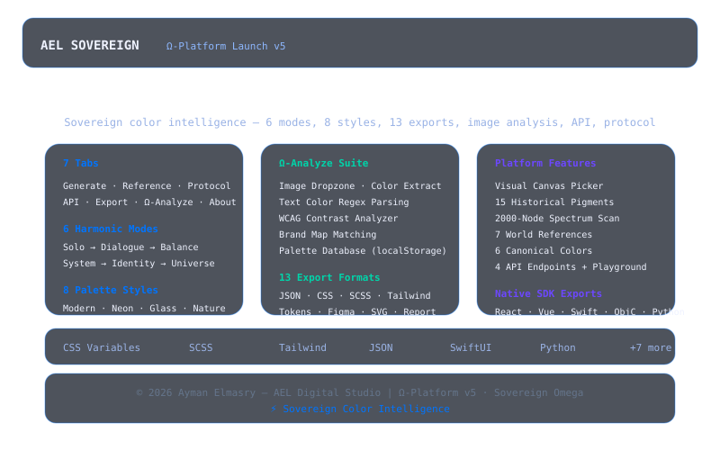

# AEL Sovereign Ω-Platform Launch v5.0

> This project was previously developed under the name **AEL Color OS** and has been renamed to **AEL Omega Platform** to better reflect its expanded scope. The archived repository is available at [ael-color-os](https://github.com/aymanelmasryael/ael-color-os).

> **Sovereign color intelligence system** — 6 harmonic modes, 8 palette styles, 7 world references, canonical protocol, API playground, visual picker, 15 historical pigments, 2K spectrum scan, image analysis, text extraction, brand map matching, contrast analyzer, palette database, and 13-format export.
> Powered by the **AEL Color Intelligence Engine v5.0**.
> Built by Ayman Elmasry — AEL Digital Studio.

---

## Preview



---

## Table of Contents

- [Features](#features)
- [How It Works](#how-it-works)
- [Tab Architecture](#tab-architecture)
- [Project Structure](#project-structure)
- [Getting Started](#getting-started)
- [Usage](#usage)
- [Generation Modes](#generation-modes)
- [Palette Styles](#palette-styles)
- [World Reference Systems](#world-reference-systems)
- [Canonical Colors](#canonical-colors)
- [Historical Pigments](#historical-pigments)
- [API Endpoints](#api-endpoints)
- [Brand Map](#brand-map)
- [Ω-Analyze Features](#ω-analyze-features)
- [Export Formats](#export-formats)
- [Technical Details](#technical-details)
- [Credits](#credits)

---

## Features

- **7-Tab Architecture** — Generate (Modes/Styles/HSL/Picker), Reference, Protocol, API, Export, Ω-Analyze, About
- **6 Harmonic Modes** — Solo Philosophy → Harmonized Universe. Each mode uses a distinct color harmony rule (monochromatic, complementary, triadic, tetradic, analogous, compound)
- **8 Palette Styles** — Modern Gradient, Neon Cyberpunk, Glass Morphism, Nature Inspired, Tech & Data, Luxury Premium, Minimal Clean, Vibrant Energy
- **Deterministic PRNG** — Mulberry32 algorithm ensures reproducibility: same seed = same colors
- **Generative Philosophy** — every color state carries an archetype, core meaning, psychological impact, cultural interpretation, and 2026 relevance
- **WCAG Contrast Analysis** — real-time luminance calculation, contrast ratio with AA/AAA grading
- **Canvas Color Picker** — visual hue/saturation canvas with live pointer and hex output
- **15 Historical Pigments** — Tyrian Purple to Tiffany Blue with era/origin annotations
- **2K Spectrum Scan** — 2000 color nodes displayed in a continuous spectrum grid
- **Favorites** — save/remove favorite colors to localStorage with persistent storage
- **7 World Reference Systems** — Pantone, Adobe Color, Coolors, Color Hunt, Canva Pro, WGSN, Behance
- **6 Canonical Colors** — Primary, Secondary, Accent, Error, Success, Warning with protocol authority
- **Color Protocol** — canonical download with authority statement and MIT license
- **REST API v4.0** — 4 mock endpoints (generate-system, analyze-image, predict-trends, check-accessibility) with interactive playground
- **Image Analysis** — drag & drop image upload with dominant color extraction (top 8 quantized colors)
- **Text Color Extraction** — paste any text to extract hex and rgb() color references via regex
- **Brand Map** — 5 AEL brand colors with semantic meaning, clickable for instant loading
- **Ω Palette Database** — localStorage-backed palette CRUD with save/load/export all/clear
- **13-Format Export** — JSON, CSS, SCSS, Tailwind, Design Tokens, Figma, SVG, Report, React, Vue, SwiftUI, Objective-C, Python — all with deterministic checksums
- **Glassmorphism UI** — dark theme with #0074FF blue accents, animated particle background, responsive layout

---

## How It Works

### Sovereign Color Engine

The engine uses a deterministic Mulberry32 PRNG seeded from a combination of the current timestamp, mode index, and intensity value. Each generation pass produces a set of color states that follow a specific harmonic mode:

1. **Seed Generation** — `currentSeed = timestamp × mode × intensity`
2. **Color Derivation** — base hue is randomized, then hues are distributed according to the active harmony rule
3. **Perceptual Constraint** — saturation and lightness are clamped to perceptual ranges based on intensity
4. **Philosophy Synthesis** — each color state receives a generative philosophy:
   - Archetype (e.g., "Neural Signal", "Cosmic Harmony")
   - Core meaning derived from hue angle
   - Psychological impact from saturation
   - Cultural interpretation from temperature
   - Best usage from perceptual properties
5. **Science Calculation** — luminance, WCAG contrast ratio, temperature, saturation class
6. **Checksum Generation** — each export format gets a deterministic 8-char hex checksum

```
Seed → Mulberry32 PRNG → Hue Distribution → HSL Generation → Hex Conversion
↓
Philosophy Engine + Science Engine + WCAG Engine
↓
Color States → 13 Export Formats (JSON / CSS / SCSS / Tokens / ...)
```

---

## Tab Architecture

| # | Tab | Sub-Tabs | Purpose |
|---|-----|----------|---------|
| 1 | **Generate** | Modes, Styles, HSL, Picker | Main generation workspace with mode/style selection, HSL fine-tuning, and visual color picker |
| 2 | **Reference** | — | World Color Systems, Historical Pigments, Full Spectrum Scan (2,000 nodes) |
| 3 | **Protocol** | — | Canonical Color Authority, Download Protocol cards, MIT License |
| 4 | **API** | — | 4 Mock Endpoints with interactive playground and native SDK integrations |
| 5 | **Export** | — | 13 Export Format cards with one-click download and verifiable checksums |
| 6 | **Ω-Analyze** | — | Image Analysis, Brand Map, Text Extraction, Contrast Analyzer, Palette Database |
| 7 | **About** | — | System description, integrated systems, tech stack, version history, contact |

---

## Project Structure

```
ael-omega-platform/
├── index.html                    # HTML5 7-tab interface
├── ael_omega_platform.css        # All styles (glassmorphism, dark theme, modern components)
├── ael_omega_platform.js         # Full sovereign engine + all merged features (~960 lines)
├── screenshot.svg                # Project preview image
├── ael-logo.svg                  # AEL brand logo
├── .nojekyll                     # GitHub Pages compatibility
├── .gitignore
└── README.md
```

Flat single-page architecture:
- **HTML5** — semantic 7-tab structure with sub-navigation
- **CSS3** — custom properties, Grid/Flexbox, glassmorphism, responsive
- **Vanilla JS (ES2020+)** — `SovereignRandom`, `AELColorEngine`, `PaletteDatabase`, `UIController`

---

## Getting Started

### Run Locally

```bash
git clone https://github.com/aymanelmasryael/ael-omega-platform.git
cd ael-omega-platform
open index.html
```

Or simply open `index.html` in any modern browser — no server required.

### Prerequisites

- A modern web browser (Chrome, Firefox, Safari, Edge)
- No build tools, no package managers, no server

---

## Usage

1. Open the **Generate** tab
2. Select a **Generation Mode** from the sub-tabs (1-6)
3. Choose a **Palette Style** from the Styles sub-tab
4. Adjust **Intensity** slider to control hue range, saturation, and lightness variance
5. Click **Generate** to begin continuous generation, or **Stop** to freeze the current set
6. **Fine-tune** with Hue/Saturation/Lightness sliders for live preview
7. Use the **Visual Picker** for manual color selection
8. Switch to **Reference** to explore world systems, pigments, or the spectrum grid
9. Visit **Protocol** for canonical color authority downloads
10. Test the **API** playground with mock endpoints
11. Use **Ω-Analyze** for image upload, text extraction, contrast checking, or palette management
12. Switch to the **Export** tab and choose from 13 formats
13. Each export includes a **Checksum** for reproducibility verification

---

## Generation Modes

| Mode | Name | Colors | Harmony Rule | Best For |
|------|------|--------|-------------|----------|
| 1 | **Solo Philosophy** | 1 | Monochromatic | Single-color systems, minimal branding |
| 2 | **Dialogue & Tension** | 2 | Complementary | Duotone, contrast-driven designs |
| 3 | **Balance** | 3 | Triadic | Balanced UI, dashboard palettes |
| 4 | **System Logic** | 4 | Tetradic | Complex design systems, data viz |
| 5 | **Identity Formation** | 5 | Analogous | Brand identity, gradient systems |
| 6 | **Harmonized Universe** | 6-8 | Compound | Full design systems, comprehensive palettes |

---

## Palette Styles

| Style | Description |
|-------|-------------|
| **Modern Gradient** | Smooth contemporary gradients with balanced transitions |
| **Neon Cyberpunk** | High-intensity neon colors with electric saturation |
| **Glass Morphism** | Frosted, translucent color palette with soft pastels |
| **Nature Inspired** | Earthy, organic tones drawn from natural landscapes |
| **Tech & Data** | Digital, precise colors for data visualization |
| **Luxury Premium** | Rich, deep jewel tones with gold and metallic accents |
| **Minimal Clean** | Simple, understated palette with maximum clarity |
| **Vibrant Energy** | Bold, energetic colors with high chroma |

---

## World Reference Systems

| System | Source | Description |
|--------|--------|-------------|
| **Pantone** | Color of the Year 2025 | Industry-standard color matching system |
| **Adobe Color** | AI-Generated Gradients | AI-powered color gradient generation |
| **Coolors** | Dynamic Palettes | Fast palette generation platform |
| **Color Hunt** | Curated Sets | Community-curated color collections |
| **Canva Pro** | Professional Suite | Design platform color trends |
| **WGSN** | Future Forecast | Trend forecasting for color and design |
| **Behance** | Trend Analysis | Creative portfolio color insights |

---

## Canonical Colors

| Color | Hex | Badge |
|-------|-----|-------|
| **Primary** | `#0074FF` | Canonical |
| **Secondary** | `#6C47FF` | Canonical |
| **Accent** | `#00D4AA` | Canonical |
| **Error** | `#FF4D4D` | Canonical |
| **Success** | `#10B981` | Canonical |
| **Warning** | `#F59E0B` | Canonical |

---

## Historical Pigments

| Pigment | Hex | Era/Origin |
|---------|-----|------------|
| Tyrian Purple | `#66023C` | Imperial Rome |
| Egyptian Blue | `#1034A6` | Ancient Egypt |
| Vermilion | `#E34234` | Renaissance Art |
| Ultramarine | `#120A8F` | Precious Lapis |
| Mummy Brown | `#8F4B28` | 19th Century |
| Scheele's Green | `#478800` | Victorian Arsenic |
| Han Purple | `#5218FA` | Qin Dynasty |
| Maya Blue | `#73C2FB` | Pre-Columbian |
| India Yellow | `#FF5F00` | Mughal Empire |
| Prussian Blue | `#003153` | First Modern Pigment |
| Dragon's Blood | `#8D021F` | Ancient Resin |
| Saffron | `#F4C430` | Monastic Robes |
| Klein Blue | `#002FA7` | Modern Art |
| Baker-Miller Pink | `#FF91AF` | Psychological Calm |
| Tiffany Blue | `#0ABAB5` | Luxury Brand |

---

## API Endpoints

| Method | Endpoint | Description |
|--------|----------|-------------|
| **POST** | `/api/v4/generate-system` | Generate complete color systems based on brand identity, industry, and target audience |
| **POST** | `/api/v4/analyze-image` | Extract color systems from images using computer vision and AI analysis |
| **GET** | `/api/v4/predict-trends` | AI-powered color trend predictions for upcoming seasons and industries |
| **POST** | `/api/v4/check-accessibility` | Validate color combinations for WCAG compliance and accessibility standards |

---

## Brand Map

| Brand | Hex | Semantic |
|-------|-----|----------|
| AEL Blue | `#0074FF` | Trust & Intelligence |
| AEL Violet | `#6C47FF` | Innovation & Vision |
| AEL Teal | `#00D4AA` | Growth & Balance |
| AEL Pink | `#FF4D8D` | Energy & Action |
| AEL Amber | `#F59E0B` | Warning & Warmth |

---

## Ω-Analyze Features

### Image Analysis
Drag & drop or click to upload an image (JPG, PNG, SVG). The engine quantizes pixels into 20-step buckets and extracts the top 8 dominant colors as clickable swatches.

### Text Color Extraction
Paste any text or code to scan for `#hex` and `rgb()` color notation. Results are deduplicated and rendered as clickable swatches that load into the base color input.

### Contrast Analyzer
Tests a base color against 5 standard backgrounds (White, Black, Light Gray, Dark Gray, Background) using WCAG 2.1 luminance calculation. Grades each pair as AAA, AA, or FAIL.

### Ω Palette Database
LocalStorage-backed persistence (key: `ael_omega_palettes_v5`). Create named palettes from generated colors, browse saved palettes with color strip previews, export all as JSON, or clear. Click any saved palette to load its first color.

---

## Export Formats

| Format | Extension | Description | Use Case |
|--------|-----------|-------------|----------|
| **JSON (AI-Ready)** | `.json` | Complete color state data with semantic intelligence and schema versioning | AI pipelines, data interchange |
| **CSS Variables** | `.css` | Production-ready CSS custom properties with HSL/RGB fallbacks | Web projects, design systems |
| **SCSS/Sass** | `.scss` | Complete SCSS variable system with mixins and color map | Sass-based projects |
| **Tailwind Config** | `.js` | Tailwind CSS config file with extended color palette | Tailwind CSS projects |
| **Design Tokens** | `.json` | Style Dictionary format with philosophy attributes | Design token pipelines |
| **Figma Colors** | `.json` | Figma-ready color library JSON format | Figma design libraries |
| **SVG Palette** | `.svg` | Vector color palette as SVG with hex labels | Visual documentation |
| **Philosophy Report** | `.txt` | Plain-text analysis with archetype and 2026 relevance | Documentation, stakeholder reviews |
| **React Hook** | `.js` | Custom useAELColors React hook with getColor() | React applications |
| **Vue Plugin** | `.js` | Vue.js plugin with $aelColors global property | Vue.js applications |
| **SwiftUI** | `.swift` | SwiftUI Color extension with palette constants | iOS/macOS SwiftUI apps |
| **Objective-C** | `.m` | Obj-C color constants header file | Legacy iOS/macOS apps |
| **Python** | `.py` | Python color module with dict and HEX/RGB helpers | Python data/ML pipelines |

All exports include:
- Platform signature (`AEL_SOVEREIGN_OMEGA_v5_2026`)
- Deterministic seed for reproducibility
- 8-character hex checksum
- ISO 8601 timestamp

---

## Technical Details

| Aspect | Detail |
|--------|--------|
| Architecture | Flat single-page app (HTML5 + CSS3 + JS) |
| JavaScript | Vanilla ES2020+, 4 classes, zero dependencies |
| PRNG | Mulberry32 (deterministic, 32-bit) |
| Color math | HSL↔Hex↔RGB, CMYK, LAB, WCAG luminance, perceptual mapping |
| Philosophy engine | Archetype + meaning + psychology + culture + relevance |
| Export formats | 13 (JSON, CSS, SCSS, Tailwind, Tokens, Figma, SVG, Report, React, Vue, Swift, ObjC, Python) |
| Checksums | 8-char hex (simple hash of export content) |
| Image analysis | Canvas-based pixel quantization (20-step buckets, top-8 colors) |
| Palette storage | localStorage with JSON export |
| Animations | Canvas particle system with mouse interaction |
| Browser support | Chrome, Firefox, Safari, Edge (modern versions) |
| Processing | Fully client-side — no server required |

---

## Credits

**Created by:** Ayman Elmasry — AEL Digital Studio  
**Website:** [aymanelmasry.com](https://aymanelmasry.com)  
**Email:** [info@aymanelmasry.com](mailto:info@aymanelmasry.com)  
**License:** MIT — Free for personal and commercial use.

### Connect

[LinkedIn](https://linkedin.com/in/aymanelmasryael) · [Instagram](https://instagram.com/aymanelmasryael) · [X](https://x.com/aymanelmasryael) · [CodePen](https://codepen.io/aymanelmasryael) · [GitHub](https://github.com/aymanelmasryael) · [Behance](https://behance.net/aymanelmasryael)

---

*AEL Sovereign Ω-Platform Launch v5.0 — Sovereign color intelligence unified.*
